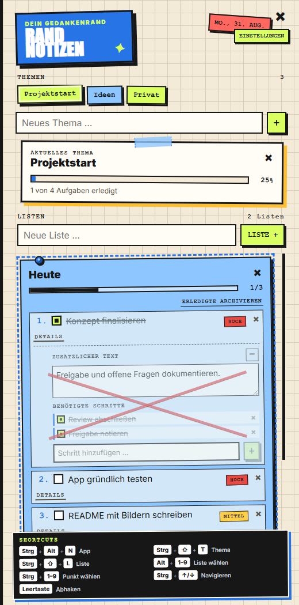
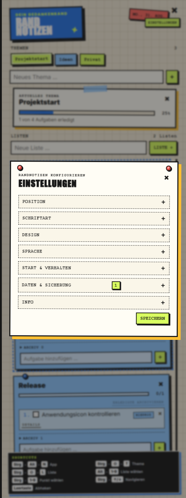

# Randnotizen

Eine native Desktop-Notizleiste für Windows, die am Bildschirmrand lebt und sich jederzeit per Tastenkombination ein- oder ausblenden lässt. Beim Programmstart gleitet sie passend zur gewählten Seite in den Bildschirm und verschwindet beim Ausblenden wieder vollständig.

Randnotizen verbindet Themen, Checklisten und Fortschrittsanzeigen mit einer verspielten Collage-Optik. Die Anwendung läuft lokal, speichert ihre Daten auf dem Rechner und bleibt über das Symbol im Windows-Infobereich erreichbar.



## Funktionen

- Themen mit beliebig vielen eigenen Listen
- Nummerierte Aufgaben mit Checkboxen und Fortschrittsanzeige
- Frei sortierbare Themen, Listen, Aufgaben und Teilschritte per Drag-and-drop
- Prioritäts-Sticker in drei Stufen
- Zusätzliche Aufgabentexte und kleine Schrittlisten
- Listenarchiv für erledigte Aufgaben mit Wiederherstellung
- Persistenter Papierkorb und schnelles Rückgängig mit `Strg + Z`
- Lokale JSON-Backups zum Exportieren und Wiederherstellen
- Rotes Abschluss-X über den Details erledigter Aufgaben
- Vollständige Tastatursteuerung für Listen und Aufgaben
- Positionierung am linken oder rechten Rand eines frei wählbaren Bildschirms
- Direkte Positionsvorschau vor dem Speichern
- Acht Designs: Papier, Nacht, Blaupause, Sonnenuntergang, Pastell, Zeitung, Neon und Minimalpapier
- Auswahl der App-Schriftart
- Automatische Lesbarkeitsskalierung passend zur verfügbaren Monitorhöhe
- Optional dauerhaft sichtbar, auch wenn eine andere App den Fokus erhält
- Deutsche und englische Benutzeroberfläche
- Optionaler automatischer Start mit Windows
- Einstellungs-Popover mit Versionsanzeige
- Einklappbare Shortcut-Übersicht direkt am unteren Fensterrand
- Kurze, aufeinander abgestimmte Animationen für Programmstart, Dialoge und neue Inhalte
- Rücksicht auf die Windows-Einstellung zum Reduzieren von Animationen
- Windows-Infobereich, globaler Hotkey und eigenes Anwendungsicon
- Schutz vor mehreren gleichzeitig gestarteten Instanzen
- Transaktionale lokale SQLite-Speicherung ohne Benutzerkonto oder Cloud-Zwang

## Tastatursteuerung

| Tastenkombination | Aktion |
| --- | --- |
| `Strg + Alt + N` | Ein-/ausblenden; bei sichtbarer App ohne Fokus den Fokus zurückholen |
| `Strg + Umschalt + T` | Eingabefeld für ein neues Thema fokussieren |
| `Strg + Umschalt + L` | Eingabefeld für eine neue Liste fokussieren |
| `Alt + 1–9` | Entsprechende Liste auswählen |
| `Strg + 1–9` | Entsprechend nummerierte Aufgabe der ausgewählten Liste markieren |
| `Strg + ↑ / ↓` | Innerhalb der Aufgaben navigieren |
| `Leertaste` | Ausgewählte Aufgabe abhaken oder wieder öffnen |
| `Strg + Z` | Zuletzt gelöschtes Thema, Liste, Aufgabe oder Teilschritt wiederherstellen |

Die Pfeilnavigation besitzt feste Enden: Am ersten oder letzten Punkt wird nicht zur gegenüberliegenden Seite gesprungen.

Die Shortcut-Übersicht am unteren Rand lässt sich durch Anklicken nach unten schieben. Eine kleine Kante bleibt sichtbar und öffnet die Übersicht beim nächsten Klick wieder. Sie kann außerdem mit `Tab` fokussiert und mit `Enter` oder `Leertaste` bedient werden.

## Aufgabendetails und Schritte

Jede Aufgabe kann über **Details** einen zusätzlichen Text und beliebig viele benötigte Schritte erhalten. Die Schritte lassen sich unabhängig voneinander abhaken. Wird die übergeordnete Aufgabe abgeschlossen, bleiben die Informationen erhalten und werden mit einem roten X als erledigt markiert.

Die Datenstruktur ist abwärtskompatibel: Vorhandene Aufgaben erhalten beim ersten Laden automatisch leere Detail- und Schritt-Felder.

## Organisieren und aufräumen

- Themen, Listen, aktive Aufgaben und benötigte Schritte lassen sich innerhalb ihrer Ebene mit der Maus neu anordnen. Die neue Reihenfolge wird sofort gespeichert.
- Jede Aufgabe kann in den Details als **niedrig**, **mittel** oder **hoch** priorisiert werden. Der passende farbige Sticker erscheint direkt an der Aufgabe.
- **Erledigte archivieren** verschiebt alle abgeschlossenen Aufgaben einer Liste in deren Archiv. Archivierte Aufgaben lassen sich jederzeit wiederherstellen und werden nicht mehr in der aktiven Fortschrittsanzeige gezählt.
- Gelöschte Themen, Listen, Aufgaben und Schritte landen zunächst im persistenten Papierkorb. `Strg + Z` stellt den zuletzt gelöschten Eintrag wieder her; im Einstellungs-Popover können einzelne Einträge gewählt oder der Papierkorb endgültig geleert werden.

## Backup und Wiederherstellung

Im Bereich **Daten & Sicherung** des Einstellungs-Popovers lässt sich der vollständige Arbeitsbereich als lesbare JSON-Datei exportieren. Ein solches Backup enthält Themen, Listen, Aufgaben, Details, Schritte, Prioritäten, Archivstatus und Papierkorb. Beim Wiederherstellen wird das gewählte Backup geprüft, in SQLite übernommen und anschließend auf das aktuelle Datenschema migriert.

Backups bleiben vollständig lokal. Randnotizen überträgt keine Notizen an einen Cloud-Dienst.

## Einstellungen

Über die Schaltfläche **Einstellungen** öffnet sich ein Popover direkt über dem Hauptpanel. Es entsteht dadurch kein zusätzliches Windows-Fenster und kein weiterer Taskleisten-Eintrag.

- Änderungen an Bildschirm und Seite werden sofort als Vorschau gezeigt, aber erst mit **Speichern** dauerhaft übernommen. Die Startanimation läuft genau einmal pro Programmstart und wird weder durch diese Vorschau noch durch das Speichern oder erneute Einblenden ausgelöst.
- Die acht Designs erscheinen als anklickbare Vorschaukarten. Die Auswahl wird sofort auf die App angewendet, aber erst mit **Speichern** dauerhaft übernommen; Schließen oder `Esc` stellt das gespeicherte Design wieder her.
- Für den normalen App-Text stehen Inter, Nunito Sans, Atkinson Hyperlegible, Lora und JetBrains Mono bereit. Die Schrift wird bei der Auswahl sofort als Vorschau angewendet und erst beim Speichern dauerhaft übernommen. Alle Schriftdateien werden mit Randnotizen ausgeliefert und funktionieren dadurch vollständig offline.
- Die Textgröße passt sich automatisch an die verfügbare Monitorhöhe an: Bereits auf kleineren Bildschirmen gilt eine gut lesbare Mindestskalierung, auf größeren Monitoren wächst sie stufenlos weiter.
- **Bei Fokusverlust geöffnet lassen** verhindert das automatische Ausblenden. `Strg + Alt + N` setzt dann den Fokus wieder auf Randnotizen.
- Sprache, Windows-Autostart, Version und Urheberrecht befinden sich ebenfalls an dieser zentralen Stelle.
- Backup, Wiederherstellung, Rückgängig und Papierkorb sind im Abschnitt **Daten & Sicherung** gebündelt.



> Wird die portable EXE nach dem Aktivieren des Autostarts verschoben, sollte der Autostart in den Einstellungen einmal aus- und wieder eingeschaltet werden. Bei der installierten Version bleibt der Pfad bei normalen Updates stabil.

## Installation

Randnotizen ist für Windows 10 und Windows 11 gebaut. Empfohlen wird die Installation über das Setup:

1. `Randnotizen Setup <Version>.exe` herunterladen oder selbst erstellen.
2. Setup ausführen und bei Bedarf den Installationsordner auswählen.
3. Randnotizen über das Startmenü oder die Desktop-Verknüpfung starten.
4. Mit `Strg + Alt + N` ein- und ausblenden.

Beim ersten Start wird das Panel sichtbar geöffnet. Danach bleibt Randnotizen über das Symbol im Windows-Infobereich erreichbar. Ein erneuter Programmstart öffnet die bereits laufende Instanz, statt ein zweites Fenster zu erzeugen.

Alternativ steht mit `Randnotizen <Version>.exe` eine portable Ausgabe ohne Installation zur Verfügung.

### Manuelles Update

Eine neue Setup-Datei kann direkt über die vorhandene Installation installiert werden. Anwendungsdateien werden aktualisiert, während Einstellungen, SQLite-Datenbank und Backups erhalten bleiben. Für eine portable Installation wird die bisherige EXE durch die neue Version ersetzt.

Die Builds sind derzeit nicht mit einem kommerziellen Code-Signing-Zertifikat signiert. Windows kann deshalb beim ersten Start einen SmartScreen- oder Herausgeberhinweis anzeigen.

## Entwicklung

Voraussetzungen:

- Windows 10 oder 11
- Node.js und npm

Abhängigkeiten installieren und Anwendung starten:

```powershell
npm install
npm start
```

Portable Windows-EXE erstellen:

```powershell
npm run build
```

NSIS-Installer erstellen:

```powershell
npm run dist
```

Alternativ steht dafür derselbe Installer-Build unter folgendem Namen bereit:

```powershell
npm run installer
```

Die fertigen Dateien werden im Ordner `release/` abgelegt.

## Tests und Coverage

Alle Tests ausführen:

```powershell
npm test
```

Coverage-Bericht inklusive LCOV-Datei für SonarQube erzeugen:

```powershell
npm run test:coverage
```

Aktueller Stand von Version 0.2.0:

| Messwert | Abdeckung |
| --- | ---: |
| Zeilen | 96,37 % |
| Branches | 84,71 % |
| Funktionen | 97,77 % |

Der HTML-/LCOV-Bericht wird unter `coverage/` erzeugt. SonarQube liest `coverage/lcov.info` über die Konfiguration in `sonar-project.properties` ein.
Aktuell decken 23 automatisierte Tests Renderer, Hauptprozess, Hotkeys, Backup/Restore, Papierkorb, Sortierung einschließlich vollständiger Listen, Archiv, Prioritäten, Animationstrigger, Layout, eingebettete Fonts, Icons, Übersetzungen und SQLite-Migration ab. Ein zusätzlicher nativer Electron-Test bildet die vollständige Drag-and-drop-Ereigniskette einer Liste ab.

Die nativen Hotkey-, Drag-and-drop- und Layout-Prüfungen lassen sich separat starten:

```powershell
npm run test:hotkeys
npm run test:drag
npm run test:layout
```

## SonarQube

Das Projekt verwendet den SonarQube-Projektschlüssel `notizen`. Die vorbereitete PowerShell-Datei führt zuerst die Tests und anschließend die Analyse aus:

```powershell
$token = Read-Host "SonarQube Token" -MaskInput
./sonar.ps1 -SonarHostUrl "https://sonarqube.example.com" -Token $token
```

Die Serveradresse und der Token werden bewusst nicht im Repository gespeichert.

## Screenshots aktualisieren

Die README-Bilder werden reproduzierbar mit festen Beispieldaten aus dem aktuellen Electron-Renderer erzeugt. Echte Notizen und Einstellungen werden dabei nicht verändert.

```powershell
npm run screenshots
```

Die Bilder landen anschließend unter `docs/images/`.

## Projektstruktur

```text
src/
├─ main.js                 Electron-Hauptprozess, Tray, Fenster und Autostart
├─ preload.js              Sichere IPC-Schnittstelle für die Renderer
├─ panel-bounds.js         Positionierung auf mehreren Bildschirmen
├─ workspace-store.js      SQLite-Schema, Transaktionen und JSON-Migration
├─ translations.js         Deutsche und englische Übersetzungen
├─ tray-icon.js            Tray- und Windows-Anwendungsicon
├─ assets/
│  ├─ icon.ico
│  └─ fonts/               Eingebettete OFL-Schriften und Lizenztexte
└─ renderer/
   ├─ index.html           Hauptpanel
   ├─ renderer.js          Themen-, Listen- und Tastaturlogik
   └─ styles.css           Collage-Design für Hauptpanel und Popover

tests/                     Unit- und UI-Tests
scripts/                   Icon-, Screenshot-, Layout- und Drag-and-drop-Prüfungen
docs/images/               Bilder für diese README
```

Die eingebetteten Schriftfamilien stammen aus dem offiziellen [Google-Fonts-Repository](https://github.com/google/fonts) und stehen jeweils unter der SIL Open Font License 1.1. Die zugehörigen `OFL.txt`-Dateien werden zusammen mit den Fonts unter `src/assets/fonts/` ausgeliefert.

## SQLite und Datenmigration

Der Arbeitsbereich wird in `workspace.sqlite` im Electron-`userData`-Verzeichnis gespeichert. Themen, Listen, Aufgaben und benötigte Schritte liegen in getrennten, über Fremdschlüssel verbundenen Tabellen. Schreibvorgänge laufen in Transaktionen, damit ein unvollständiger Speichervorgang nicht nur einen Teil des Arbeitsbereichs aktualisiert.

Beim ersten Start mit SQLite gilt folgende Migration:

1. Existiert noch kein gespeicherter SQLite-Arbeitsbereich, sucht Randnotizen zuerst nach `workspace.json` und anschließend nach der älteren `notes.json`.
2. Die vorhandenen Daten werden durch die normale Datenmigration auf das aktuelle Schema 4 gebracht. Bestehende SQLite-Datenbanken erhalten die neuen Spalten für Priorität und Archiv automatisch.
3. Der migrierte Arbeitsbereich wird transaktional in `workspace.sqlite` gespeichert.
4. Die ursprünglichen JSON-Dateien bleiben unverändert erhalten und können als Rückfallebene gesichert oder später manuell entfernt werden.

Die Einstellungen bleiben bewusst in der kleinen, menschenlesbaren `settings.json`. Randnotizen benötigt weiterhin weder ein Konto noch eine Internetverbindung für den normalen Betrieb. Verwendet wird das in der Electron-Laufzeit enthaltene [`node:sqlite`](https://nodejs.org/api/sqlite.html); dadurch ist keine zusätzliche native SQLite-Abhängigkeit erforderlich.

## Version und Urheberrecht

Aktuelle Version: **0.2.0**

**© 2026 Niklas Fulle**
